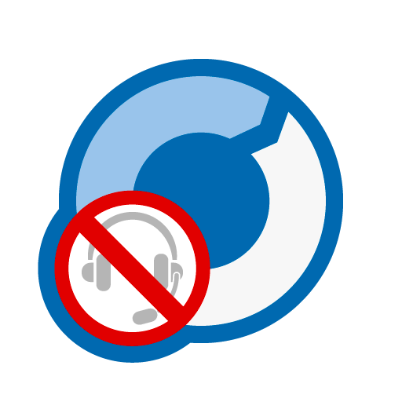

# Customizing "Optimal In-App Remote SDK for Android" apps

## Remote control feature

Remote control from the remote operators is enabled by default.

With the default setting, when the remote control is requested from the operator, a dialog is displayed and asks user whether to allow remote control. According to user's choices, following actions take place.

- When "Allow" is selected
  - Operators are allowed to remotely control the device.
  - When the operator requests remote control access again, it is accepted automatically without dialog.
- When "Allow(Only once)" is selected
  - Operators are allowed to remotely control the device.
  - When the operator requests remote control access again, dialog is displayed.
- When "Deny" is selected
  - Operator is not allowed to remotely control the device.
  - When the operator requests remote control access again, dialog is displayed.

### Disabling remote control

If remote control operation from remote operators need to be disabled, call "setRemoteInputEnabled" method with "false" argument immediately after creating "ORIASession" class instance.
When the argument is set to "false", no dialog prompting for permission is displayed and no remote operation will be executed.

### Allowing remote control operation automatically without permission dialog

If remote control operation from remote operator needs to be allowed without permission dialog, call "setRemoteInputAcceptsAutomaticallyEnabled" with "true" argument immediately after creating "ORIASession" class instance. When the property is set to "true", no dialog prompting for permission is displayed and remote operation will be allowed automatically.

## Voice call feature

Voice call with remote operators is disabled by default.

When voice call with remote operators is enabled, voice call session will start when the remote operator requests for voice call.

Icon is displayed during the voice call. Tapping icon displays a menu, which provides users with following options.

- Option to output audio from the speakers (Hands free mode)
  − Option to mute the microphone

### Enabling voice call

If voice call with remote operator needs to be allowed, call "setVoiceChatEnabled" with "true" argument immediately after creating "ORIASession" class instance.

### Use not ORIAApplication class but the other class inheriting with Application class

`ORIAApplication` inheriting with `android.app.Application` has one `ORIASession` instance for controlling the instance.
However, there is a limitation that Android application contains only one `android.app.Application` instance.
SDK provides an alternative method in case using other `android.app.Application` inherit class.

The following example is using a `MyApplication` class inheriting with `android.app.Application`.

<details open>
<summary>Kotlin</summary>

```kotlin
// 1. Import these classes.
import jp.co.optim.optimalremote.IORIASessionProvider
import jp.co.optim.optimalremote.ORIASession
import jp.co.optim.optimalremote.ORIASessionProvider
import android.app.Application
import android.content.Context

// 2. Implement IORIASessionProvider.
class MyApplication : Application(), IORIASessionProvider {
    // 3. ORIASessionProvider implementation is same as ORIAApplication.
    private val mSessionProvider = ORIASessionProvider()

    ...

    override fun initSession(context: Context, profile: String, key: String) {
        // 4. Initialize connecting to operator.
        mSessionProvider.initSession(context, profile, key)
    }

    // 5. Return ORIASession instance.
    override val session: ORIASession?
        get() = mSessionProvider.session

    ...
}
```

</details>

<details>
<summary>Java</summary>

```java
// 1. Import these classes.
import jp.co.optim.optimalremote.IORIASessionProvider;
import jp.co.optim.optimalremote.ORIASession;
import jp.co.optim.optimalremote.ORIASessionProvider;
import android.app.Application;
import android.content.Context;
...

// 2. Implement IORIASessionProvider.
public class MyApplication extends Application implements IORIASessionProvider {
  // 3. ORIASessionProvider implementation is same as ORIAApplication.
  private final ORIASessionProvider mSessionProvider = new ORIASessionProvider();

  ...

  @Override
  public void initSession(Context context, String profile, String key) {
    // 4. Initialize connecting to operator.
    mSessionProvider.initSession(context, profile, key);
  }

  @Override
  public ORIASession getSession() {
    // 5. Return ORIASession instance.
    return mSessionProvider.getSession();
  }

  ...
}
```

</details>

## To capture TextureView

`TextureView` capture is unavailable by default in the SDK. To enable capture, set the `setCaptureTextureViewEnabled` method to `true`. To turn it off, set the method to `false`.
Enabling capture for `TextureView` may affect the performance of the application.
The `setCaptureTextureViewEnabled` setting cannot be changed while conducting support. Confirm the setting before calling the `open` method of the `ORIASession` object.

## Switching the display language of the SDK

To switch the language displayed in the SDK UI, update the `locale` property of the `ORIASession` object as follows.

<details open>
<summary>Kotlin</summary>

```kotlin
// Switch to English
session.locale = Locale.EN

// Switch to Japanese
session.locale = Locale.JA

// Follow the device settings
session.locale = Locale.SYSTEM
```

</details>

<details>
<summary>Java</summary>

```java
// Switch to English
session.setLocale(Locale.EN);

// Switch to Japanese
session.setLocale(Locale.JA);

// Follow the device settings
session.setLocale(Locale.SYSTEM);
```

</details>

## Customizing the SDK UI design

The images and text displayed in the SDK UI can be customized.

### Customizing images

You can customize images by adding images to your project with the specified file names.

For example, if you want to change the icon displayed during support, add your customized image to the project with the file name `res/drawable-hdpi/optimal_remote_menu.png`.

The subdirectory (the `drawable-hdpi` part) should be changed according to the pixel density. For details, please refer to the following:

- <https://developer.android.com/training/multiscreen/screendensities>

The customizable images and their corresponding file names are as follows:

| No. | Image                               | Description                                      | Default                                                           | Recommended size (scale at hdpi) |
| --- | ----------------------------------- | ------------------------------------------------ | ----------------------------------------------------------------- | -------------------------------- |
| 1   | `optimal_remote_menu.png`           | Icon displayed during screen sharing             |            | 114 px × 114 px                  |
| 2   | `optimal_remote_logo.png`           | Logo image displayed at the top of the screen    |            | 206 px × 32 px                   |
| 3   | `optimal_remote_ticket_bg.9.png`    | Background image for the receipt number          |     | 114 px × 90 px                   |
| 4   | `optimal_remote_speaker_loud.png`   | Speaker-on button in the screen sharing menu     |    | 144 px × 144 px                  |
| 5   | `optimal_remote_speaker_normal.png` | Speaker-off button in the screen sharing menu    |  | 144 px × 144 px                  |
| 6   | `optimal_remote_mic_on.png`         | Microphone-on button in the screen sharing menu  |          | 144 px × 144 px                  |
| 7   | `optimal_remote_mic_off.png`        | Microphone-off button in the screen sharing menu |         | 144 px × 144 px                  |
| 8   | `optimal_remote_disconnect.png`     | Disconnect button in the screen sharing menu     |      | 144 px × 144 px                  |
| 9   | `optimal_remote_pause.png`          | Icon displayed while screen sharing is paused    |           | 512 px × 512 px                  |

> [!WARNING]
> Only PNG images are supported.

> [!WARNING]
> If the image size greatly exceeds or falls below the recommended size, the UI layout may break.

### Customizing text

You can customize text by adding string resources to your project with the specified keys.

For example, to change the label of the disconnect button in the screen sharing menu to `DISCONNECT`, implement the following:

```xml:res/values/strings.xml
<?xml version="1.0" encoding="utf-8"?>
<resources>
    <string name="menu_disconnect_button_label">DISCONNECT</string>
</resources>
```

The customizable text and their corresponding keys are as follows:

| No. | Key                            | Description                                               | Default (Japanese)                                 | Default (English)                                 |
| --- | ------------------------------ | --------------------------------------------------------- | -------------------------------------------------- | ------------------------------------------------- |
| 1   | `sdp_did_reserve_indicator`    | Text displayed above the receipt number                   | `下記の受付番号を\nオペレーターにお伝えください。` | `Please tell below \nReceipt Number to operator.` |
| 2   | `lobby_button_cancel`          | Label of the button displayed below the receipt number    | `キャンセル`                                       | `Cancel`                                          |
| 3   | `menu_speaker_button_label`    | Label of the speaker button in the screen sharing menu    | `スピーカー`                                       | `Speaker`                                         |
| 4   | `menu_mute_button_label`       | Label of the microphone button in the screen sharing menu | `消音`                                             | `Mute`                                            |
| 5   | `menu_disconnect_button_label` | Label of the disconnect button in the screen sharing menu | `切断`                                             | `Disconnect`                                      |

> [!WARNING]
> If the text length greatly exceeds or falls below the default, the UI layout may break.

## Masking feature

Views that you do not want to share with the operator tool can be masked.

### Specifying tags

Specify the [android:tag](https://developer.android.com/reference/android/view/View#attr_android:tag) of the Views you do not want to share, and the target Views will be masked and displayed.

For example, to mask Views with the tags "view1" and "view2", implement the following:

<details open>
<summary>Kotlin</summary>

```kotlin
session.setMaskElements(
    listOf(
        "view1",
        "view2"
    )
)
```

</details>

<details>
<summary>Java</summary>

```java
session.setMaskElements(
    List.of(
        "view1",
        "view2"
    )
);
```

</details>

## Screen sharing pause feature

You can temporarily pause screen sharing with the operator.

Even while screen sharing is paused, the connection to the operator tool is maintained, so screen sharing can be resumed from the client tool.

To temporarily pause screen sharing with the operator, call the `pause` method of the `ORIASession` class as follows:

<details open>
<summary>Kotlin</summary>

```kotlin
session.pause()
```

</details>

<details>
<summary>Java</summary>

```java
session.pause();
```

</details>

To resume screen sharing with the operator, call the `resume` method of the `ORIASession` class as follows:

<details open>
<summary>Kotlin</summary>

```kotlin
session.resume()
```

</details>

<details>
<summary>Java</summary>

```java
session.resume();
```

</details>
